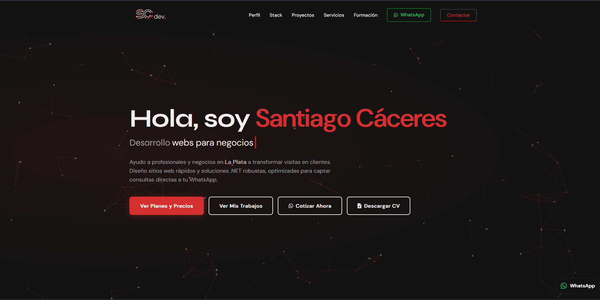

# scdev | Santiago Cáceres - Full Stack Developer Portfolio



> **Portfolio Personal** diseñado para mostrar proyectos, habilidades y trayectoria académica. Desarrollado con un enfoque en diseño moderno (Dark Mode), interactividad y experiencia de usuario fluida.

---

## 🚀 Demo
Podés ver el sitio en vivo aquí: https://scdev.com.ar/

---

## 🛠️ Tecnologías Utilizadas

Este proyecto fue construido utilizando tecnologías web estándar y librerías ligeras para maximizar la performance y la compatibilidad.

* **Core:** HTML5, CSS3, JavaScript (ES6+).
* **Diseño:** CSS Grid, Flexbox, Variables CSS (Custom Properties).
* **Librerías:**
    * `Particles.js`: Para el fondo animado interactivo.
    * `SweetAlert2`: Para las notificaciones modales elegantes.
    * `FontAwesome`: Para la iconografía.
* **Backend (Formulario):** Integración con **FormSubmit** vía AJAX (fetch API).

---

## ✨ Funcionalidades Clave

* **🎨 UI Moderna:** Diseño oscuro (Dark Theme) con paleta de colores personalizada (`#121212` y acentos en `#D32F2F`).
* **⚡ Navegación SPA:** Sensación de "Single Page Application" con navegación suave (Smooth Scroll) y menú inteligente que detecta la sección activa.
* **✨ Efectos Visuales:**
    * Efecto **Typewriter** (escritura automática) en el título principal.
    * Animaciones **Scroll Reveal** (los elementos aparecen suavemente al bajar).
    * Efecto de partículas reactivas al mouse.
* **📧 Formulario AJAX:** Envío de correos sin recargar la página, con validación y feedback visual (Loader + Alerta de éxito).
* **📱 Diseño Responsive:** Totalmente adaptado a móviles, tablets y escritorio.

---

## 📂 Estructura del Proyecto

```text
scdev-portfolio/
├── assets/             # Archivos estáticos (CV en PDF)
├── images/             # Logotipos y capturas
├── index.html          # Estructura semántica
├── style.css           # Estilos y animaciones
├── script.js           # Lógica, partículas y manejo de DOM
└── README.md           # Documentación

📬 Contacto

Si tenés alguna sugerencia o querés contactarme:

    LinkedIn: Santiago Cáceres

    Email: 1caceres.santiago5@gmail.com

© 2026 Santiago Cáceres. Todos los derechos reservados.